Debuggin React components in the browser
========================================


Today's web browsers have incredible development tools installed by default. Examples are Chrome DevTools and Firefox Developer Tools. These are essential if you are doing any type of web development because they expose what's really going on in terms of DOM, styles, performance, whatever. 

With React, you still need all these tools, but you need more than that. The basic principle of React is declarative markup within JavaScript components. If this abstraction is not present in your tools you are making things more complicated than they should be.


React Developer Tools
---------------------

The first step is to install the plugin in your browser. I will use Firefox but there is also a version for Chrome. 

<p align="center">
            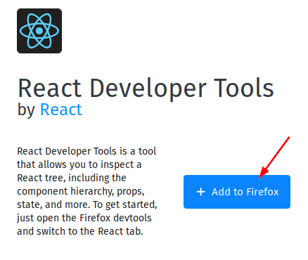
</p>

So we'll see how this new icon appears in our plugin bar.


<p align="center">
            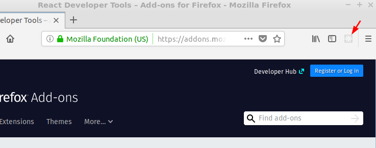
</p>

Then, using create-react-app let's prepare a small application to test our new tool:
```bash
$ create-react-app debugging-react
```
And we'll run the development server:
```bash
$ cd debugging-react
debugging-react$ npm start
```

At this point we should see that the icon has awakened.


<p align="center">
            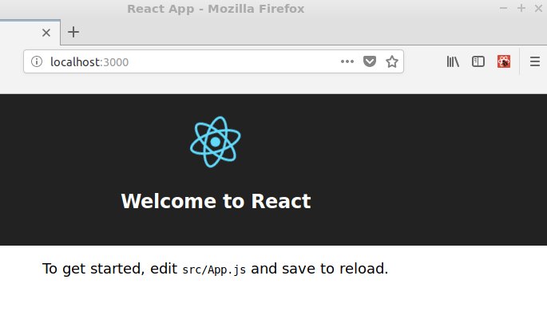
</p>


Let's press it and see what it says.


<p align="center">
            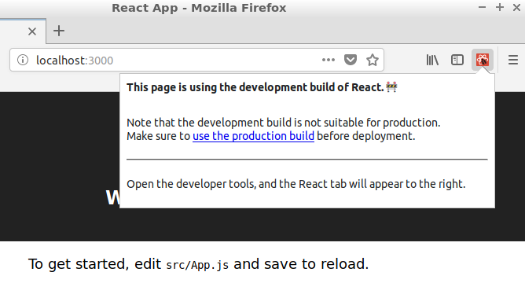
</p>


It detected that we are working with a development version. Let's open developer tools inside Firefox (pressing F12 for example) and see what else it can tell us.

<p align="center">
            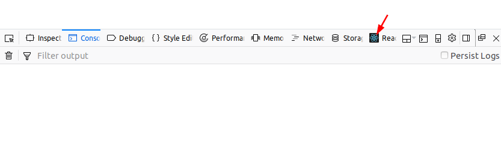
</p>

It will take a moment to load the content of the page and then you will see the root React Component, which should be very similar to the JSX code that'create-react-app' has used to create it:


<p align="center">
            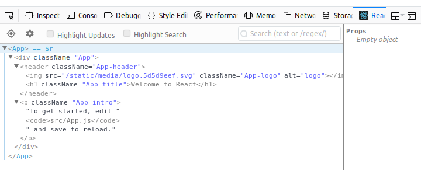
</p>


That's a good start. But to see how it works more deeply, let's create a couple of elements.

First a simple component that receives the value of a number, stores it in its state and displays it on the screen:

```javascript
// debuggin-react/src/SimpleNumber.js

import React, { Component } from 'react';

class SimpleNumber extends Component {
            constructor(props){
                        super(props);
                        this.state = {label: "I'm a random number with value "};
            }

            render(){
                        return (<div className="SimpleNumber">
                        <p>{this.state.label}{this.props.value}</p>
                        </div>);
            }
}

export default SimpleNumber;
```


And a container that creates 5 of those simple numbers and gives them a random value:

```javascript
// debuggin-react/src/SimpleContainer.js

import React, { Component } from 'react';
import SimpleNumber from './SimpleNumber';

class SimpleContainer extends Component {
            constructor(props){
                        super(props);
                        this.state = { amount: 0, arraySimpleNumbers: []};
                        this.timer = setInterval(this.addNumber.bind(this),2000);
            }

            addNumber(){
                        let amount = this.state.amount + 1; 
                        let arraySimpleNumbers = this.state.arraySimpleNumbers;
                        let value = Math.floor(Math.random()* 5 + 1);
                        arraySimpleNumbers.push(<SimpleNumber key={this.state.amount} value={value}/>);
                        if (amount === 5){
                                    clearInterval(this.timer);
                        }
                        this.setState({amount: amount, arraySimpleNumbers: arraySimpleNumbers});
            }
            
            render(){
                        return (<div className="SimpleContainer">
                                    <h3>Simple Container</h3>
                                    <div>
                                    {this.state.arraySimpleNumbers}
                                    </div>
                                    </div>);
            }
}
export default SimpleContainer;
```

Finally, let's remove all the superfluous from the entry point of our React application:

```javascript
// debuggin-react/src/App.js

import React, { Component } from 'react';
import './App.css';
import SimpleContainer from './SimpleContainer'

class App extends Component {
            render() {
                        return (
                        <div className="App">
                        <SimpleContainer>
                        </SimpleContainer>
                        </div>
                        );
            }
}

export default App;
```

We should have something like this right now:


<p align="center">
            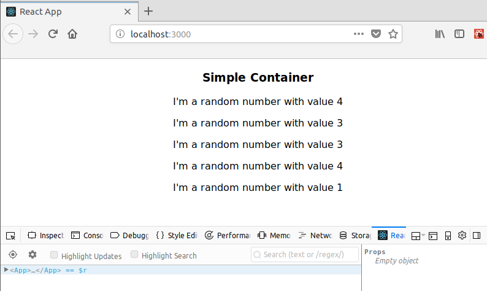
</p>


And if we reload the page and display &lt;App&gt; in the React Developer Tools tab, and then display &lt;SimpleContainer&gt; we will see how it is slowly populated with a total of five &lt;SimpleNumber&gt;.


<p align="center">
            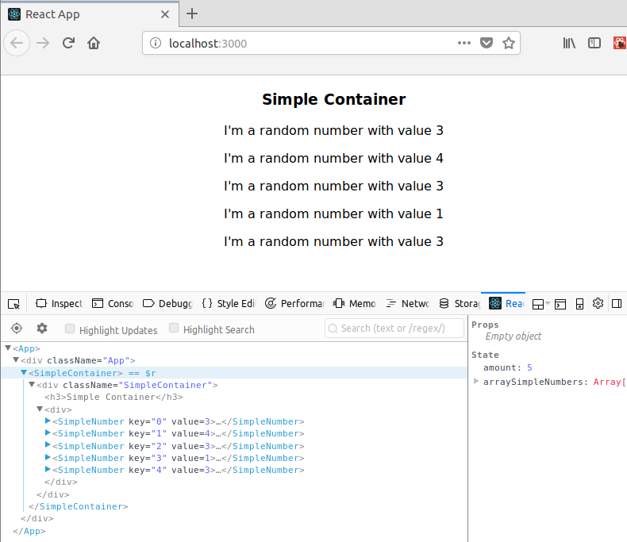
</p>


We see that all the React elements are highlighted and the rest of the DOM elements are not. Very useful. Also in the right window we can see the Props and State values of the element.


Let's select one of the elements &lt;SimpleNumber&gt; and see what it contains:


<p align="center">
            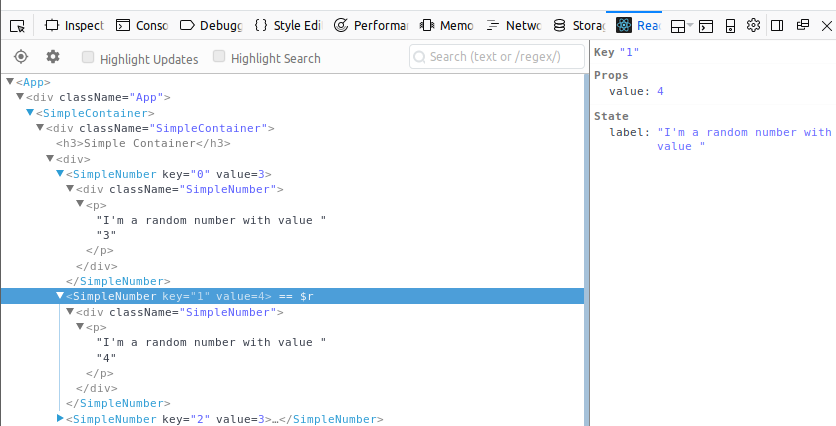
</p>


We can see that the &lt;SimpleNumber&gt; element has a Key property that we have passed from the next higher element, as well as Props and State. 

It is interesting to note that these Props and State values can be modified directly from the React Developer Tools. Let's do it:


<p align="center">
            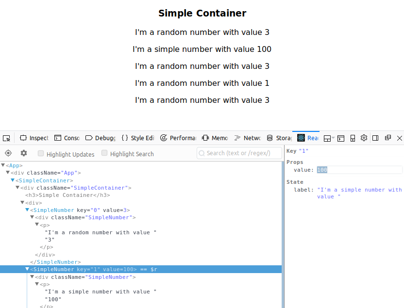
</p>


The modified values are automatically rendered on the page.


HighLight Updates
-----------------

React Developer Tools also allow us to monitor when one of the React elements is updated. To do this we will reload the page and select "Highlight Updates".


<p align="center">
            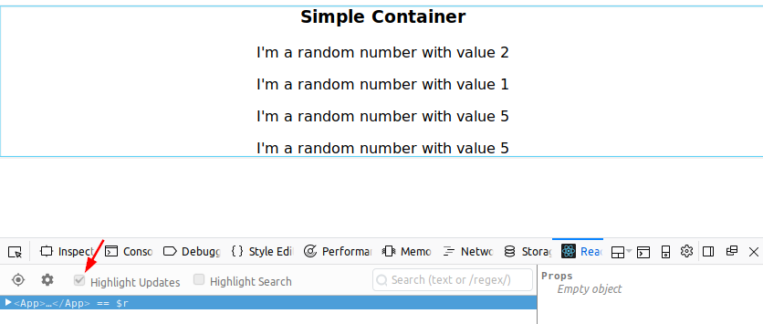
</p>


With this option enabled every time an item is rendered again it will be highlighted for a moment. Very useful, for example, to check if items that should not be updated are doing so.

